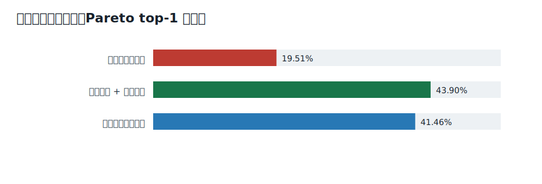
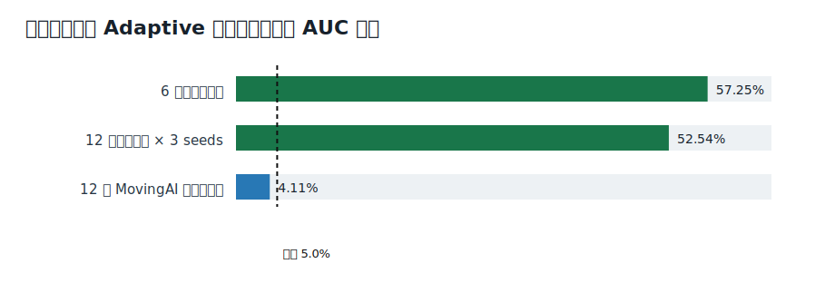
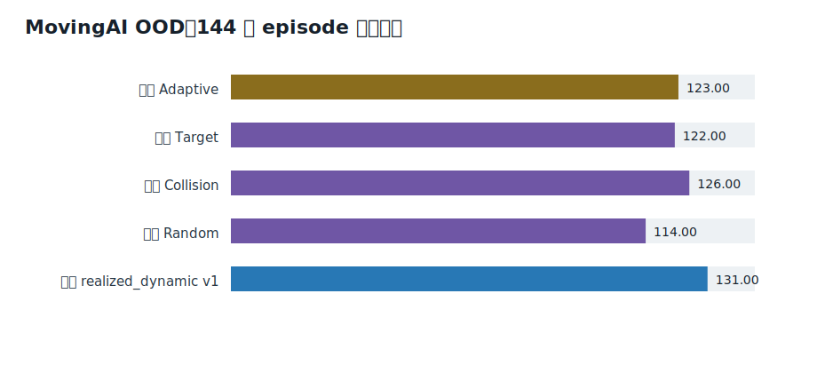
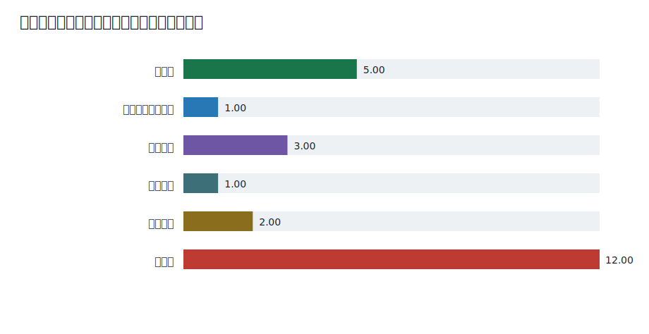

# InitLNS 动态显式邻域控制研究报告

> 本报告由冻结证据清单生成。所有数值来自已登记的正式 JSON；未重新训练模型、采集标签或修改实验门槛。

## 摘要

基于当前动态冲突状态和实际 agent 邻域的 InitLNS 高层控制，在同族未见地图和多 solver seed 上得到闭环验证；标准 MovingAI 跨布局实验表现出广泛正信号，但未达到预注册的 5% 主门槛；静态地图、OD 和密度上下文的增量价值尚未得到证明。

研究最初希望利用地图拓扑、静态 OD、agent 密度和当前冲突共同控制 InitLNS。两轮静态上下文审计均未证明这些全局特征在动态状态之外具有稳定增量价值。后续机制实验发现，名义 `(seed, rule, size)` 动作是随机邻域生成分布，而实际生成的 agent 集合具有更稳定的修复价值。因此，最终方法转为依据当前冲突状态、路径局部结构和实际候选集合进行显式邻域排序。

冻结策略在同族未见地图、多 solver seed 的闭环实验中显著降低冲突 AUC；MovingAI 外部布局上成功数也提高，但主 AUC 改善为 4.105%，低于预注册 5% 门槛。因此，本项目确认的是同族地图上的动态显式邻域控制，不确认静态上下文迁移，也不宣称严格的跨布局泛化或 RL 结果。

## 1. 问题定义

项目研究 MAPF-LNS2 的 InitLNS 首次可行解阶段。PP 初始规划可能产生冲突，InitLNS 反复选择一组 agent、删除其路径并用 PP+SIPPS 修复，直到得到首个无冲突解。研究对象是高层邻域选择，不是已有可行解后的 anytime 成本优化，也不替换低层 PP+SIPPS。

主要指标是固定 100 步冲突 AUC、成功率、time-to-feasible、修复次数和 SIPPS 搜索工作。SOC 是次要指标，因为研究边界终止于首个可行解。

## 2. 完整 LNS2 基线

项目内置官方 MAPF-LNS2 提交 `1369823985a15944f9a339226d521f61605a6d17`。扩展仅增加单步修复 API、proposal/observer 接口、显式邻域动作和低层计数。官方模式在固定实例上的路径 SHA256 仍为 `915ee104f0168c463f05925541fef1c22ec1eb37e9bf8df7ab09807753013ecf`。

InitLNS 对照为 Adaptive、Target、Collision 和 Random；无冲突后的 anytime LNS 所用 RandomWalk、Intersection、Random 和 Adaptive 属于另一阶段，不混入本项目主指标。

## 3. 数据设计

开发数据使用 regular_beltway、compartmentalized 和 dead_end_aisles 三类互补结构，任务为 balanced/bottleneck 静态 OD，agent 数量主要为 80/100。零冲突任务保留为 PP 直接可行，高冲突任务不因困难被丢弃。训练、Validation、独立确认和 MovingAI OOD 使用不同地图与任务 seed。

这些任务是静态 OD，不包含 release time、任务队列或 lifelong MAPF。MovingAI 外部确认固定使用 12 张 Random、Maze、Room、Warehouse 和 Game 地图、两个 random scenario、预注册 agent 数量及 solver seeds `[1,2,3]`，不按结果替换实例。

## 4. 动作空间演变

1. 最初动作是冲突 seed、Target/Collision/Random 和邻域大小 4/8/16。
2. 八 trial 稳定性分析表明，同一名义动作会生成差异较大的 agent 集合，尤其 Random 和 Collision。
3. 固定实际 agent 集合后，动作 eta-squared 达到 0.595，split-half Spearman 达到 0.803。
4. 最终控制器先调用官方生成器获得最多 18 个去重显式邻域，再用冻结排序器选择一个集合执行修复。第一版不从头自回归生成 agent 子集。

## 5. 方法

`realized_dynamic` 使用生成动作前可见的信息：当前冲突数、冲突图分量与 degree、delay/path 分布、修复阶段、低层搜索历史，以及候选集合覆盖的内部/边界冲突边、冲突 agent/分量、selected-agent delay 与路径统计、路径重合、空间范围、局部障碍率、节点度和 articulation 暴露。

模型是固定参数的 pairwise HistGradientBoostingClassifier。候选只在同一状态内构造 Pareto 支配对；trial 先按候选聚合，不能当作独立样本。候选得分来自对其他候选的预测胜率，候选哈希负责确定性平局。修复后路径、冲突下降、runtime 和 generated nodes 不进入输入特征。

静态地图类别、OD、密度和流量统计只作为消融。它们没有进入最终冻结控制器。RL 始终处于门控状态，本项目没有训练 RL policy。

## 6. 实验协议

离线评估按地图留出，状态是有效独立单位；trial 和同地图任务不是额外独立地图样本。闭环策略必须从相同初始 fingerprint 开始，proposal 不得修改状态，非法动作不得回退到 Adaptive。所有门槛在读取确认标签前固定；失败结果也写入正式报告。



## 7. 主要结果

### 7.1 显式邻域与离线排序

显式重放覆盖 23 个状态、412 个邻域和 3296 个结果，完整性错误为零。自然分布独立确认中，`realized_dynamic` 的 Pareto top-1 从 19.51% 提高到 43.90%，冲突 regret 降低 33.83%，10/12 张地图不劣。

### 7.2 同族地图闭环

首轮 6 张新地图闭环中，两种策略均成功 24/24，冻结策略将冲突 AUC 降低 57.25%，6/6 地图不劣。多 seed 确认覆盖 12 张新地图、144 个 episode；两种策略均成功 144/144，AUC 改善 52.54%，11/12 地图不劣，三条 solver seed 流分别保持正改善。

控制器 hardening 在保持所有 episode、transition、邻域和冲突轨迹完全一致的前提下，将回放中的 realized_dynamic 平均控制时间从 11.47 秒降至 0.455 秒，约减少 96%。多 seed 正式实验中端到端墙钟仍为 0.715 秒，对照为 0.273 秒，因此不宣称部署速度更快。



### 7.3 MovingAI 外部布局

12 张 MovingAI 地图的 720 个五策略 episode 全部完成。冻结策略成功 131/144，Adaptive 为 123/144；冻结策略在 9/9 有修复状态的地图和 5/5 地图族上平均不劣，地图 bootstrap 下界为正。

但固定预算冲突 AUC 只改善 4.105%，低于预注册 5% 主门槛。严格 decision 保持 `stop_cross_layout_claim_and_consolidate_results`。这属于广泛外部支持，不是确认的跨布局主张。



## 8. 迁移边界

静态地图结构是一类输入信息；跨地图迁移是一种训练/测试关系，两者并不等价。当前动态状态没有输入地图身份，但路径、冲突图、局部障碍率和 articulation 暴露是地图、OD、密度和历史修复共同作用后的结果，因此隐式包含与当前决策相关的局部地图信息。

现有证据支持“动态局部表示在同族未见地图上泛化”。它不支持“手工全局地图/OD/密度特征提供额外迁移价值”。MovingAI 结果接近但未通过预注册主门槛，所以严格跨布局泛化仍未确认。

## 9. 相关工作定位

| 工作 | 主要阶段与方法 | 与本项目的边界 |
| --- | --- | --- |
| [MAPF-ML-LNS](https://ojs.aaai.org/index.php/AAAI/article/view/21168) | 监督排序由规则生成的候选 agent 集合，主要优化已有可行解的 cost | 最接近显式邻域排序，但不是 InitLNS 首次可行修复 |
| [NNS](https://proceedings.iclr.cc/paper_files/paper/2024/hash/d41f8403e9bb5141bc2c81fad7658185-Abstract-Conference.html) | 卷积与注意力编码路径时空交互并选择邻域 | 表示更强，研究阶段和跨尺寸迁移边界不同 |
| [BALANCE](https://arxiv.org/abs/2312.16767) | 非上下文 bandit 联合选择 destroy heuristic 与邻域大小 | 动作维度相近，但面向 anytime LNS 且不读取丰富当前状态 |
| [ADDRESS](https://arxiv.org/abs/2408.02960) | delay 启发式与 Thompson sampling 选择 seed | 使用动态 delay，但没有显式候选集合排序 |
| [LNS2+RL](https://arxiv.org/abs/2405.17794) | RL 替换早期低层 repair planner，之后切回 PP+SIPPS | 修改低层修复器，不是高层 agent 邻域选择 |
| [DiffLNS](https://arxiv.org/abs/2605.13296) | 扩散模型生成更好的初始化路径，再交给 LNS2 | 改进初始化而非 InitLNS 高层修复动作 |

本项目不声称首次学习邻域、首次可变大小或首次将 RL 用于 LNS2。可辨认的研究位置是：在 InitLNS 从有冲突到首个可行解的阶段，排序由官方生成器产生的实际 agent 邻域，并系统报告静态上下文、长期信用和 repair order 的负面门控结果。

## 10. 负面结果与停止规则

| 实验 | 状态 | 结论 |
| --- | --- | --- |
| [静态上下文首次可学习性审计](https://github.com/BETAoffical/structure-guided-lns2/blob/pre-minimal-runtime-2026-07-20/research/docs/context/CONTEXT_AUDIT.md) | 未通过 | 完整上下文相对动态状态仅增加 4.17 个百分点，AUC regret 反而恶化，未通过门槛。 |
| [静态上下文二次验证](https://github.com/BETAoffical/structure-guided-lns2/blob/pre-minimal-runtime-2026-07-20/research/docs/context/CONTEXT_SECONDARY_AUDIT.md) | 未通过 | 真实上下文 top-1 与 AUC 指标仅处于置换分布第 6.2% 和 59.2%，并出现 91% size 集中。 |
| [局部表示恢复审计](https://github.com/BETAoffical/structure-guided-lns2/blob/pre-minimal-runtime-2026-07-20/research/docs/representation/LOCAL_REPRESENTATION_AUDIT.md) | 未通过 | local_pre、realized 和静态上下文均未通过预注册恢复门槛；局部表示存在点估计信号但地图间不稳定。 |
| [MovingAI 初始机制探针](https://github.com/BETAoffical/structure-guided-lns2/blob/pre-minimal-runtime-2026-07-20/research/docs/neighborhood/MOVINGAI_MECHANISM_PROBE.md) | 机制证据 | 动作和邻域确有差异，但独立状态和 trial 不足，不能训练迁移模型。 |
| [MovingAI 首轮标签质量审计](https://github.com/BETAoffical/structure-guided-lns2/blob/pre-minimal-runtime-2026-07-20/research/docs/neighborhood/MOVINGAI_PROBE_QUALITY.md) | 未通过 | 结果行数掩盖了有效样本不足，rank、最佳集合和实际邻域稳定性均未通过。 |
| [MovingAI 八 trial 标签质量审计](https://github.com/BETAoffical/structure-guided-lns2/blob/pre-minimal-runtime-2026-07-20/research/docs/neighborhood/MOVINGAI_PROBE_QUALITY.md) | 机制证据 | 排序 Spearman 提高到 0.684，但最佳集合与实际邻域稳定性仍不足，需独立地图。 |
| [独立布局名义动作确认](https://github.com/BETAoffical/structure-guided-lns2/blob/pre-minimal-runtime-2026-07-20/research/docs/neighborhood/INDEPENDENT_LAYOUT_PROBE.md) | 未通过 | 名义动作 eta-squared 和 Pareto-family 稳定性未通过，动作需重定义为实际 agent 集合。 |
| [首次独立确认 qualification](https://github.com/BETAoffical/structure-guided-lns2/blob/pre-minimal-runtime-2026-07-20/research/docs/neighborhood/REALIZED_RANKING_CONFIRMATION.md) | 证据不足 | 48/48 reset 有效，但只有 11/12 地图满足成对覆盖，按规则停止且未重抽 seed。 |
| [策略访问状态首次 qualification](https://github.com/BETAoffical/structure-guided-lns2/blob/pre-minimal-runtime-2026-07-20/research/docs/policy/POLICY_VISITED_AGGREGATION.md) | 证据不足 | 总非零状态足够，但两个 split/layout 单元未达到不合理的 75% 门槛，按规则未重抽。 |
| [自然分布策略访问状态聚合](https://github.com/BETAoffical/structure-guided-lns2/blob/pre-minimal-runtime-2026-07-20/research/docs/policy/POLICY_VISITED_NATURAL_DISTRIBUTION.md) | 未通过 | v2 top-1 与 v1 相同，regret 仅改善 4.9993% 且地图 bootstrap 跨零，未推广模型。 |
| [排序目标对齐审计](https://github.com/BETAoffical/structure-guided-lns2/blob/pre-minimal-runtime-2026-07-20/research/docs/policy/RANKING_OBJECTIVE_AUDIT.md) | 未通过 | 效果差加权 pairwise 与双头 outcome 模型均低于原 v1，目标替换未解决跨地图 top-1。 |
| [GBDT 容量曲线审计](https://github.com/BETAoffical/structure-guided-lns2/blob/pre-minimal-runtime-2026-07-20/research/docs/representation/MODEL_CAPACITY_AUDIT.md) | 未通过 | 更大模型提高训练拟合却显著降低留图表现，诊断为过拟合而非容量不足。 |
| [冲突图神经表示审计](https://github.com/BETAoffical/structure-guided-lns2/blob/pre-minimal-runtime-2026-07-20/research/docs/representation/GRAPH_REPRESENTATION_AUDIT.md) | 未通过 | 冲突边相对 DeepSets 有信息，但 MLP、DeepSets 和 GNN 均未超过原 GBDT。 |
| [冲突图统计特征 GBDT 审计](https://github.com/BETAoffical/structure-guided-lns2/blob/pre-minimal-runtime-2026-07-20/research/docs/representation/GRAPH_FEATURE_GBDT_AUDIT.md) | 未通过 | 新增图特征略提高 pairwise accuracy，但 top-1 与 regret 均未改善，停止监督表示扩展。 |
| [Policy-visited Horizon-4 长期信用审计](https://github.com/BETAoffical/structure-guided-lns2/blob/pre-minimal-runtime-2026-07-20/research/docs/sequential/SEQUENTIAL_CREDIT_AUDIT.md) | 未通过 | H4 oracle 机会存在，但长期标签 split-half 稳定性与 H1/H4 差异门槛失败。 |
| [PP repair order 机制探针](https://github.com/BETAoffical/structure-guided-lns2/blob/pre-minimal-runtime-2026-07-20/research/docs/sequential/REPAIR_ORDER_PROBE.md) | 机制证据 | repair order 对结果有实质影响且无固定顺序支配，但随机顺序标签仍不稳定。 |
| [上下文 repair-order selector 审计](https://github.com/BETAoffical/structure-guided-lns2/blob/pre-minimal-runtime-2026-07-20/research/docs/context/CONTEXTUAL_REPAIR_ORDER_AUDIT.md) | 未通过 | selector 仅改善 1.16% AUC、置换百分位 55.2%，并将可行率从 66.7% 降至 59.7%。 |

H4 审计虽然显示 23.7% oracle AUC 机会，但 split-half Spearman、Pareto Jaccard 和最佳集合重合均低于 0.5，不能形成稳定长期标签。repair order 会实质改变结果，但当前上下文 selector 只改善 1.16% 且降低可行率。增加 GBDT 容量造成跨地图过拟合，MLP、DeepSets、GNN 和图统计 GBDT 也未超过冻结 v1。按照预注册规则，这些结果停止了 RL 与继续调参。



## 11. 局限

- 最强确认仍来自三类人工结构，不能代表全部 MAPF 地图。
- MovingAI 中只有 74/144 episode 进入修复，地图级区间较宽。
- 冻结排序器依赖手工聚合特征，约 19.6% 的 MovingAI 被选特征超出开发范围。
- 候选生成仍需枚举多个 seed/rule/size，虽然已批处理加速，但墙钟未稳定优于 Adaptive。
- 稳定的长期价值标签和 RL 信用分配没有得到验证。

## 12. 后续路线

当前研究先以本报告收束。若开启独立新课题，优先验证 outcome-blind 的候选剪枝和批处理，在冻结 v1 选择质量不退化的前提下降低 proposal、特征和两两推理成本。新的时空图模型或 RL 必须使用新的预注册数据和门槛，不能用于改写本轮 MovingAI 结论。

## 附录 A：冻结证据登记

| 实验 | 类别 | 状态 | 登记 | 正式来源 | SHA256 |
| --- | --- | --- | --- | --- | --- |
| 静态上下文首次可学习性审计 | static_context | 未通过 | 实现与结果同一提交 `060904d`，不作为独立预注册 | `build/initlns-context-audit-v2/context_audit.json` | `ae140b32fe45...` |
| 静态上下文二次验证 | static_context | 未通过 | 实现与结果同一提交 `008dc54`，不作为独立预注册 | `build/initlns-context-secondary-final/secondary_audit.json` | `f5f58590e9b2...` |
| 局部表示恢复审计 | representation | 未通过 | 实现与结果同一提交 `dc527dd`，不作为独立预注册 | `build/initlns-local-representation-audit/local_representation_audit.json` | `732c8fde2829...` |
| MovingAI 初始机制探针 | action_mechanism | 机制证据 | 实现与结果同一提交 `d0b75b9`，不作为独立预注册 | `build/movingai-mechanism-probe-report-deduplicated/movingai_mechanism_probe.json` | `8aa38bc4e9f8...` |
| MovingAI 首轮标签质量审计 | label_quality | 未通过 | 实现与结果同一提交 `05170c9`，不作为独立预注册 | `build/movingai-probe-quality-audit/movingai_probe_quality.json` | `617575d7d57d...` |
| MovingAI 八 trial 标签质量审计 | label_quality | 机制证据 | 实现与结果同一提交 `05170c9`，不作为独立预注册 | `build/movingai-mechanism-probe-v2-quality/movingai_probe_quality.json` | `df5cc26b4b76...` |
| 独立布局名义动作确认 | action_mechanism | 未通过 | 实现与结果同一提交 `62faca3`，不作为独立预注册 | `build/initlns-independent-layout-probe-v1-report/independent_layout_probe.json` | `834a9f0fe096...` |
| 显式 agent 邻域稳定性探针 | action_mechanism | 已确认 | 实现与结果同一提交 `5c43d75`，不作为独立预注册 | `build/realized-neighborhood-stability-probe-v1-report/realized_neighborhood_probe.json` | `f5997317c02f...` |
| 显式邻域排序可学习性审计 | offline_learning | 已确认 | 实现与结果同一提交 `2405b35`，不作为独立预注册 | `build/initlns-realized-neighborhood-ranking-audit-v1/realized_neighborhood_ranking_audit.json` | `99eacd47419f...` |
| 首次独立确认 qualification | data_design | 证据不足 | 独立预注册 `6501821`，数据前修订 `5dfd360`，结果 `42005fa` | `build/initlns-realized-ranking-confirmation-v1b-collection/qualification_report.json` | `1c43756588d3...` |
| 自然冲突分布独立确认 | offline_learning | 已确认 | 独立预注册 `6b91104`，结果 `f907eda` | `build/initlns-natural-distribution-confirmation-v1-report/natural_distribution_confirmation.json` | `846f0e7809b9...` |
| 冻结显式邻域排序器闭环确认 | closed_loop | 已确认 | 独立预注册 `4b7028a`，结果 `b5d76da` | `build/initlns-closed-loop-confirmation-v1-report/closed_loop_confirmation.json` | `ac7031374ed3...` |
| 闭环控制器等价加速 | engineering | 工程结果 | 实现与结果同一提交 `da91471`，不作为独立预注册 | `build/initlns-closed-loop-hardening-final-v2/equivalence_report.json` | `0d02a6d24c8e...` |
| 同族新地图多 seed 闭环确认 | closed_loop | 已确认 | 独立预注册 `a51c6f9`，数据前修订 `7532591`，结果 `2ae6b19` | `build/initlns-closed-loop-multiseed-v1-report/closed_loop_confirmation.json` | `210fbf10aba0...` |
| 策略访问状态首次 qualification | data_design | 证据不足 | 独立预注册 `d33177b`，数据前修订 `e8cf65c`，结果 `e4810a3` | `build/initlns-policy-visited-v1-collection/qualification_report.json` | `7ab77f75c4d8...` |
| 自然分布策略访问状态聚合 | offline_learning | 未通过 | 独立预注册 `9dce805`，结果 `873a083` | `build/initlns-policy-visited-natural-v2-offline/offline_report.json` | `856c6a217413...` |
| 排序目标对齐审计 | model_diagnosis | 未通过 | 实现与结果同一提交 `e3565cb`，不作为独立预注册 | `build/initlns-ranking-objective-audit-v1/audit_report.json` | `352baf6b150d...` |
| GBDT 容量曲线审计 | model_diagnosis | 未通过 | 实现与结果同一提交 `2b3df80`，不作为独立预注册 | `build/initlns-model-capacity-audit-v1/capacity_audit_report.json` | `76d5233b4b45...` |
| 冲突图神经表示审计 | model_diagnosis | 未通过 | 实现与结果同一提交 `a0b4b40`，不作为独立预注册 | `build/initlns-graph-representation-audit-v2/graph_representation_audit.json` | `5485182f9c4c...` |
| 冲突图统计特征 GBDT 审计 | model_diagnosis | 未通过 | 独立预注册 `7139ca9`，结果 `e9a7269` | `build/initlns-graph-feature-gbdt-audit-v1/graph_feature_gbdt_audit.json` | `196dd55ebc49...` |
| Policy-visited Horizon-4 长期信用审计 | sequential_credit | 未通过 | 独立预注册 `6f3a33b`，结果 `7ef46b8` | `build/initlns-sequential-credit-audit-v1/sequential_credit_audit.json` | `4baeb9e4e6ca...` |
| PP repair order 机制探针 | repair_order | 机制证据 | 独立预注册 `66b37a1`，结果 `5c6a869` | `build/initlns-repair-order-probe-v1/repair_order_report.json` | `142b4e69d87f...` |
| 上下文 repair-order selector 审计 | repair_order | 未通过 | 独立预注册 `c982e2d`，结果 `920d338` | `build/initlns-contextual-repair-order-audit-v1/contextual_repair_order_audit.json` | `a169d30abfc2...` |
| 冻结 V1 MovingAI 跨布局闭环确认 | external_generalization | 外部支持但未确认 | 独立预注册 `606374a`，结果 `d726450` | `build/initlns-movingai-ood-report-v1/movingai_ood_confirmation.json` | `e931721f0cdc...` |

完整指标见 `artifacts/initlns-research-evidence-v1/evidence_manifest.json` 和 `metrics.csv`。严格复核命令：

```powershell
python scripts/consolidate_research_results.py --verify-build
```
